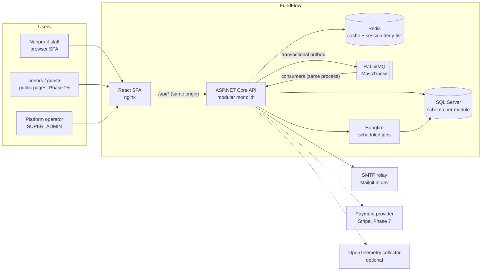
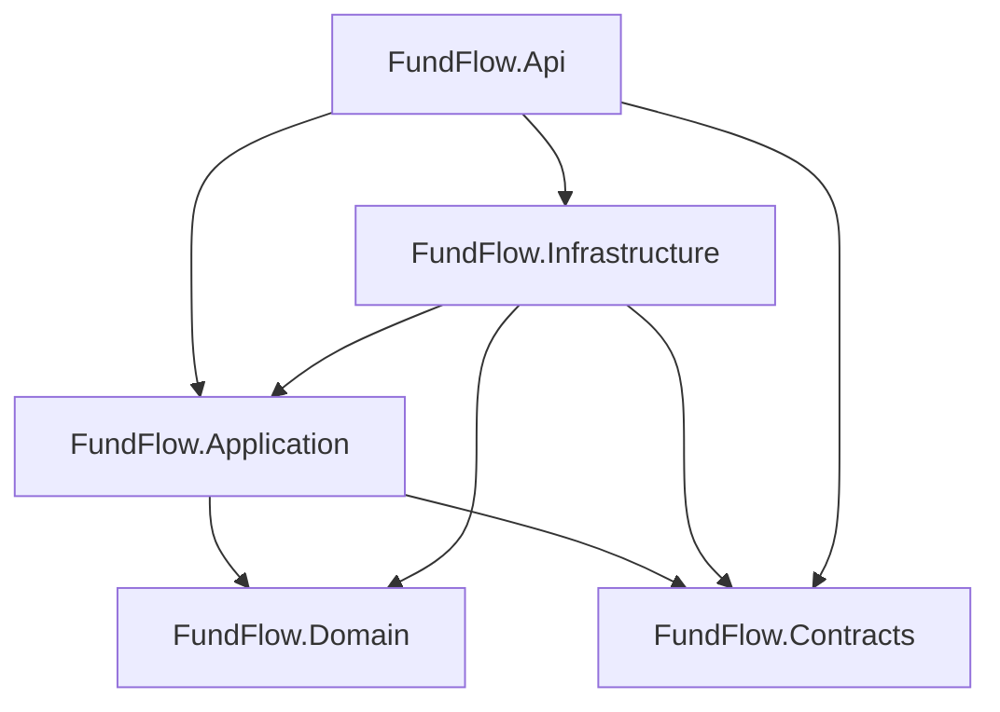
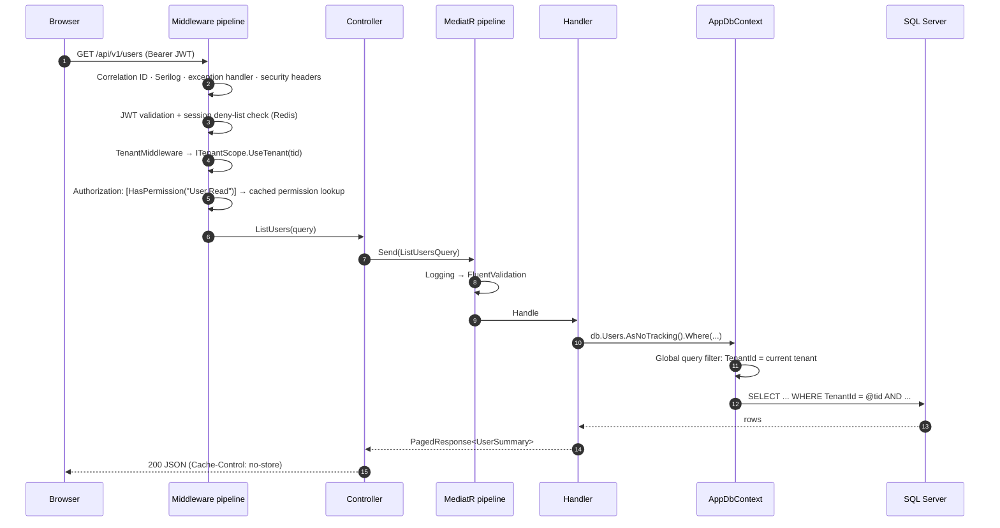
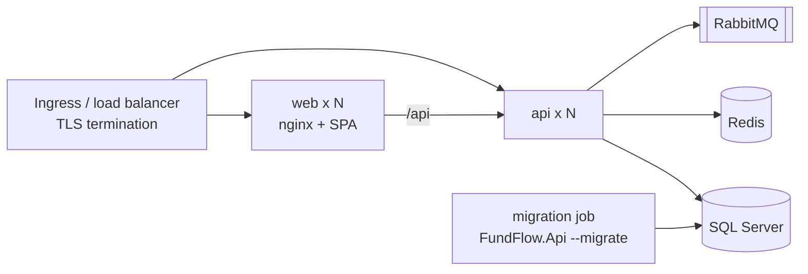

# FundFlow architecture

FundFlow is a multi-tenant SaaS platform for nonprofit fundraising: donor CRM, campaigns, donations, events, auctions,
sponsors, volunteers, communications and reporting. It is built as a **modular monolith**: one deployable API, one
database, strict internal module boundaries, designed so a module can be extracted later without a rewrite.

> Status: **Phase 1 is complete** (platform foundation: identity, tenants, security, base UI, infrastructure).
> See [roadmap.md](roadmap.md). Business modules (donors, campaigns, …) arrive in Phases 2–7 on top of this foundation.

## System context



The browser only ever talks to **its own origin**. nginx (Docker/production) or the Vite dev server proxies `/api` to
the API, so the HttpOnly refresh-token cookie is first-party and no CORS is needed for the SPA.

## Repository layout

```
FundFlow/
├─ src/
│  ├─ FundFlow.Domain/          Entities, value objects, domain events, business rules. No dependencies.
│  ├─ FundFlow.Contracts/       Public request/response DTOs and integration events. No dependencies.
│  ├─ FundFlow.Application/     Use cases (MediatR commands/queries), validators, abstractions (ports).
│  ├─ FundFlow.Infrastructure/  EF Core, Redis, MassTransit, Hangfire, SMTP, JWT: implements the ports.
│  └─ FundFlow.Api/             ASP.NET Core host: controllers, middleware, auth, Swagger, telemetry.
├─ tests/
│  ├─ FundFlow.Domain.Tests/            Pure unit tests of business rules.
│  ├─ FundFlow.Application.Tests/       Handlers' collaborators, validation, security services, tenant provider.
│  └─ FundFlow.Api.IntegrationTests/    Real API + real SQL Server (Testcontainers): tenant isolation, auth, authz…
├─ frontend/                    React + TypeScript SPA (feature-based)
├─ infra/                       SQL Server, Redis and RabbitMQ configuration
├─ docs/                        You are here
├─ docker-compose.yml           Full local stack
└─ .github/workflows/ci.yml
```

### Layering (Clean Architecture)



Dependencies point inwards. `Domain` and `Contracts` have **no** package dependencies. `Application` depends on
`Microsoft.EntityFrameworkCore` (for `DbSet<T>` and `IQueryable` operators) but not on any database provider:
handlers query `IAppDbContext` directly and project to DTOs rather than going through per-entity repositories
(see [conventions.md](conventions.md#no-generic-repositories)).

### Modules

Modules are **folders/namespaces inside each layer** (`Identity`, `Organizations`, `Audit`, …), not separate assemblies.
Each module also owns a **SQL schema** (`identity`, `organizations`, `audit`, …). See [modules.md](modules.md) for the
boundary rules and the planned modules.

## Request lifecycle



Write operations add three steps between the handler and the response:

1. The handler mutates domain objects (which raise **domain events**) and stages an **audit record**.
2. `SaveChangesAsync` first dispatches domain events *inside the unit of work* (handlers may enqueue emails and
   integration events into the **transactional outbox**), then the save interceptor stamps audit columns and enforces
   the tenant boundary, then everything commits in one transaction.
3. After commit, MassTransit's delivery service publishes outbox messages to RabbitMQ; consumers (e.g. email sending)
   run asynchronously, deduplicated through the inbox.

## Asynchronous processing

| Concern | Mechanism | Guarantee |
| --- | --- | --- |
| System emails (verify, reset, invite) | Domain event → outbox message → RabbitMQ → consumer → SMTP | At-least-once delivery, deduplicated by MessageId; never sent if the business transaction rolls back |
| Integration events (`UserCreated`, `OrganizationRegistered`, …) | Domain event → outbox → RabbitMQ | Same |
| Housekeeping (expired sessions/tokens) | Hangfire recurring job | Idempotent (`DELETE … WHERE older than`); overlapping runs prevented |

Email bodies contain one-time links, so payloads are encrypted with ASP.NET Core Data Protection before they enter the
outbox table or the broker.

## Cross-cutting concerns

| Concern | Where | Notes |
| --- | --- | --- |
| Multi-tenancy | `AppDbContext` query filters, `EntitySaveInterceptor`, `TenantMiddleware` | [multi-tenancy.md](multi-tenancy.md) |
| Authentication | JWT access token + rotating refresh cookie | [authentication.md](authentication.md) |
| Authorization | Permission policies (`[HasPermission]`) | Roles are only bundles of permissions |
| Validation | FluentValidation in the MediatR pipeline | Domain also enforces its own invariants |
| Errors | `GlobalExceptionHandler` → RFC 7807 | [api.md](api.md#errors) |
| Audit | `IAuditLogger` staged in the same transaction | Append-only; secrets redacted |
| Observability | Serilog (JSON), OpenTelemetry, health checks | Correlation ID on every log line and response |
| Rate limiting | ASP.NET Core rate limiter | Per-IP on auth endpoints, per-user global bucket |

## Deployment view



* The API is **stateless** (no in-process session state; caches and deny-lists live in Redis), so it scales horizontally.
* Hangfire and MassTransit consumers run inside API instances; `DisableConcurrentExecution` and the inbox make
  multiple instances safe. They can be split into a dedicated worker deployment without code changes.
* Database migrations are an **explicit deployment step** (`dotnet FundFlow.Api.dll --migrate`), never an implicit side
  effect of starting the app in production. See [database.md](database.md).

## Key decisions

Recorded as ADRs in [docs/adr](adr):

1. [Modular monolith](adr/0001-modular-monolith.md)
2. [Shared database, shared schema multi-tenancy](adr/0002-multi-tenancy.md)
3. [JWT access tokens with rotating cookie refresh tokens](adr/0003-authentication-tokens.md)
4. [Transactional outbox and in-transaction domain events](adr/0004-outbox-and-domain-events.md)
5. [Permission-based authorization](adr/0005-permission-authorization.md)
6. [Dependency licensing constraints](adr/0006-dependency-licensing.md)
