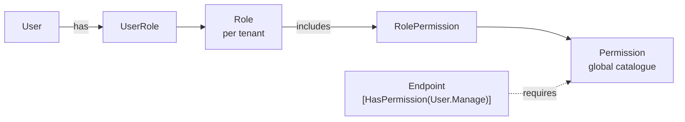

# Authentication and authorization architecture

## Summary

| Aspect | Design |
| --- | --- |
| Credentials | Email + password (PBKDF2-HMAC-SHA512, 210,000 iterations, versioned hash with transparent upgrade) |
| Access token | Short-lived (15 min) HS256 **JWT**, held in **memory** by the SPA, sent as `Authorization: Bearer` |
| Refresh token | 256-bit opaque secret in an **HttpOnly, SameSite=Strict** cookie scoped to `/api/v1/auth`; **rotated on every use**; only its SHA-256 hash is stored |
| Sessions | One `UserSession` per device. Listed and revocable by the user; revoking kills the access token immediately (deny-list) |
| Theft detection | Replaying a rotated-away refresh token after a 10 s grace period revokes the whole session |
| Account protection | Lockout after 5 failures (15 min), constant-time-ish unknown-account path, uniform error messages, per-IP rate limits |
| Email flows | Verification, password reset, invitations: single-use, expiring, hashed-at-rest tokens sent through the outbox |
| Authorization | **Permissions**, not roles. Roles are named bundles of permissions. Enforced per endpoint |
| MFA | Not implemented; seams identified below |
| OIDC | Not implemented; seams identified below |

## Sign-in and token lifecycle

```mermaid
sequenceDiagram
    autonumber
    participant SPA as Browser (SPA)
    participant API as API
    participant DB as SQL Server
    participant R as Redis

    SPA->>API: POST /auth/login {email, password}
    API->>DB: find user by NormalizedEmail (IgnoreQueryFilters)
    API->>API: locked? verify password (PBKDF2)
    API->>DB: INSERT UserSession(refreshHash) · reset failures · audit Auth.Login
    API-->>SPA: 200 {accessToken, expiresIn}  +  Set-Cookie: ff_refresh=…; HttpOnly; SameSite=Strict; Path=/api/v1/auth

    Note over SPA: access token kept in memory only
    SPA->>API: GET /users  Authorization: Bearer …
    API->>R: is session "sid" revoked?  (deny-list)
    API-->>SPA: 200

    Note over SPA,API: 15 minutes later the token expires
    SPA->>API: GET /users (expired token)
    API-->>SPA: 401
    SPA->>API: POST /auth/refresh  (cookie) + X-FundFlow-Client: web
    API->>DB: session by hash(cookie): rotate → new refresh hash; old hash kept as "previous"
    API-->>SPA: 200 {accessToken}  +  new Set-Cookie
    SPA->>API: GET /users (retried with the new token)
```

### Refresh-token rotation and reuse detection

```mermaid
stateDiagram-v2
    [*] --> Current: login creates hash H1
    Current --> Current: refresh with H1 → issue H2 (H1 becomes "previous")
    Current --> Current: replay H1 within 10 s → 401, session survives (two tabs racing)
    Current --> Revoked: replay H1 after 10 s → treated as theft; session revoked
    Current --> Revoked: logout / user revoked it / password changed / deactivated
    Current --> Expired: idle > 14 days (sliding) or age > 30 days (absolute)
    Revoked --> [*]
    Expired --> [*]
```



* The SPA serialises refreshes across tabs with a Web Lock and coalesces concurrent 401s into one refresh (single-flight). The
  cookie is shared by all tabs and rotates on use, so two simultaneous refreshes would otherwise present the same token twice.
* `UserSession` has a `rowversion`; if two refreshes still race, exactly one wins.
* Revoking a session writes its id to Redis for the access-token lifetime, and the JWT validator checks that deny-list on
  every request. Logout, "sign out this device", password reset/change, deactivation and reuse detection all use it.
  If Redis is unreachable the check fails open for at most one access-token lifetime (15 min) — a deliberate availability trade-off,
  logged as a warning.

## Why this token design

| Threat | Mitigation |
| --- | --- |
| XSS steals a long-lived credential | Refresh token is HttpOnly (unreadable by script); the access token lives only in memory and expires in 15 min; nothing in `localStorage` |
| CSRF on cookie-authenticated endpoints | `SameSite=Strict`, cookie `Path` limited to `/api/v1/auth`, required `X-FundFlow-Client: web` header (not sendable cross-site without CORS approval), `Origin` must be ours; the only cookie endpoints are refresh/logout |
| Stolen database backup | Refresh and email tokens are stored as SHA-256 hashes; passwords as salted PBKDF2; audit log and outbox payloads contain no secrets |
| Stolen refresh token | Rotation + reuse detection + idle/absolute expiry + per-device revocation |
| Credential stuffing / brute force | Account lockout, per-IP rate limit (`auth`: 20/min), uniform errors, dummy hash for unknown accounts |
| Account enumeration | Login, forgot-password and resend-verification give identical answers for known and unknown emails |
| Forged / downgraded JWT | Signature, issuer, audience and lifetime validated; only `HS256` accepted (never `none`); 30 s clock skew; production refuses to start with the development key |
| Privilege escalation | See "Authorization" |

## Email-driven flows

| Flow | Token purpose | Lifetime | Effect on redemption |
| --- | --- | --- | --- |
| Verify email | `EmailVerification` | 48 h | Confirms address (login is refused until verified) |
| Forgot / reset password | `PasswordReset` | 60 min | Sets password, confirms email, **revokes all sessions** |
| Accept invitation | `Invitation` | 7 days | Sets password, confirms email, activates account |

Issuing a new token of the same purpose supersedes older ones. Redeeming is single-use. Tokens are 256-bit random values in the
link; the database holds only the hash. Email bodies (which contain the link) are encrypted with Data Protection before they enter
the outbox table or the broker.

## Authorization



* **Endpoints check permissions**, never role names: `[HasPermission(Permissions.User.Manage)]` becomes the policy `perm:User.Manage`,
  built on demand by `PermissionPolicyProvider`. Everything is **secure by default**: the fallback policy requires an authenticated
  user, so an endpoint is private unless it explicitly opts out with `[AllowAnonymous]`.
* Effective permissions are loaded from the database, cached in Redis for 2 minutes, and **invalidated immediately** when a role's
  permissions or a user's roles change (tests prove the next request sees the change). Permissions are *not* embedded in the JWT,
  so tokens stay small and revocations don't wait for expiry. Deactivated users resolve to no access at all.
* **System roles** (`ORGANIZATION_ADMIN`, `FUNDRAISING_MANAGER`, …) are created per tenant from code templates and are read-only in the UI.
  Organizations that need something different create **custom roles**. A deployment re-syncs system roles with the templates.
* **Privilege-escalation rules** (`RoleAssignmentGuard`, `PrivilegeEscalationPolicy`):
  1. You can only grant permissions you hold yourself — when assigning roles *and* when editing a custom role — unless you are an administrator.
  2. Only administrators may change other administrators (a delegated "user manager" cannot demote the owner).
  3. An organization always keeps at least one active administrator; you cannot deactivate yourself.
  4. Tenant roles can never carry platform permissions.
* Roles and permissions: see `Permissions.cs` (35 tenant permissions plus `Platform.Manage`) and `RoleTemplates` in `SystemRoles.cs`.

## Extension points (deliberately not built yet)

| Feature | Where it plugs in |
| --- | --- |
| **MFA (TOTP / WebAuthn)** | `LoginHandler` is the single place credentials become a session. Add a second step there: return a short-lived "mfa required" challenge instead of a session, and a `/auth/mfa/verify` endpoint that completes it. `User.SecurityStamp` already rotates on credential changes. Store secrets encrypted with Data Protection. |
| **OIDC / SSO (Entra ID, Okta, Google)** | Replace the credential check with an external `id_token` validation and map the external subject to a `User` (new `ExternalLogin` table). `ITokenService`, sessions, refresh rotation and authorization stay unchanged. Per-tenant IdP config lives in `OrganizationSettings`. |
| **Asymmetric JWT signing / key rotation** | `JwtTokenService` and the bearer options are the only places that know the key; swap to RS256/ES256 with a JWKS endpoint and `kid` headers. |
| **Multi-organization membership** | Add a `Membership(UserId, TenantId)` table and select the tenant at sign-in; the token already carries a single `tenant_id`, so nothing downstream changes. |

## Where the code is

| Concern | File |
| --- | --- |
| Login / refresh / logout handlers | `Application/Identity/Auth/Login.cs`, `Refresh.cs`, `Logout.cs` |
| Session state machine | `Domain/Identity/UserSession.cs` |
| Lockout & password rules | `Domain/Identity/User.cs`, `Application/Common/Validation/ValidationRules.cs` |
| JWT issue / validate | `Infrastructure/Security/SecurityServices.cs`, `Api/Configuration/AuthenticationSetup.cs` |
| Permission policies | `Api/Security/PermissionAuthorization.cs` |
| Escalation guard | `Application/Identity/Services/RoleAssignmentGuard.cs`, `Domain/Identity/PrivilegeEscalationPolicy.cs` |
| Cookie & CSRF | `Api/Security/RefreshTokenCookie.cs`, `RequireWebClientAttribute.cs` |
| SPA token handling | `frontend/src/shared/api/http.ts`, `app/store/authStore.ts` |
