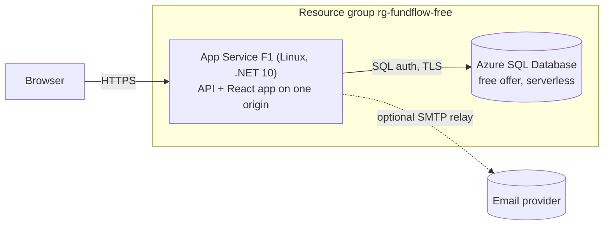

# Deploying FundFlow to Azure's free tier

One command puts the whole product (API, React app, database) on Azure without a paid resource:

```powershell
az login                                                                  # once
powershell -ExecutionPolicy Bypass -File infra\azure\deploy.ps1 -Yes     # Windows PowerShell 5.1: creates, migrates, deploys, smoke-tests
```

It takes roughly 10–15 minutes the first time and prints the site URL. This page explains what it builds, what the free tier
costs you in behaviour (there are real trade-offs), how to operate it, and how to grow out of it.

## What gets created



| Local / Docker stack | On Azure free tier | Why |
| --- | --- | --- |
| nginx serving the SPA and proxying `/api` | The API serves the React app from `wwwroot` (`SpaHosting`) | One small host, one origin: no CORS and the `SameSite=Strict` refresh cookie stays first-party. Free Static Web Apps cannot proxy to an API. |
| SQL Server container | **Azure SQL Database free offer** (`GP_S_Gen5`, 100,000 vCore-seconds + 32 GB per month) | Same engine, same migrations. |
| Redis | *nothing*: the API uses its in-process cache | No free Redis on Azure. The cache only holds the 2-minute permission snapshots and session deny-list; with one instance a per-process cache is correct. |
| RabbitMQ | MassTransit **in-memory transport** behind the same SQL transactional outbox | No free broker. Emails and events still go through the outbox in the database, so nothing is lost on a crash or restart. |
| Hangfire server | Off (`Hangfire__Enabled=false`) | Its polling would keep the serverless database awake and burn the free allowance. The only job is a daily clean-up of expired sessions and spent email tokens; without it those rows accumulate slowly, which is harmless at this scale. |
| Mailpit | Azure Communication Services Email over SMTP (or any relay, see [Email](#email)) | Azure has no free email service; ACS is billed per message (fractions of a cent). |

Everything else is the production configuration: `ASPNETCORE_ENVIRONMENT=Production`, HTTPS only, TLS 1.2+, FTPS disabled,
Swagger and the Hangfire dashboard off, a generated JWT signing key, a least-privilege database user, and the strict
security headers.

## Cost and limits (read this once)

Nothing here is billed *if you stay inside the limits*. Only free SKUs are created, and `deploy.ps1` checks after provisioning that
the plan is F1 and the database is on the free offer with auto-pause, and stops if not. Be aware that a **pay-as-you-go
subscription has no spending cap**: pass `-BudgetEmail you@example.com` to also create a monthly budget on the resource group
that emails you at 50% and 100% of `-BudgetAmount` (it only notifies; it never stops anything). The amount is in your
**billing currency**, so the default `5` means ₹5 on an INR subscription and $5 on a USD one: since nothing here should cost
anything, treat it as a canary (an alert means something changed) and raise it if you would rather be told at a larger amount.
What happens at the limits:

| Limit | Source | What you will notice |
| --- | --- | --- |
| **App Service F1**: about 60 CPU-minutes per day, 1 GB memory, 1 GB storage, no *Always On* | [Free tier](https://learn.microsoft.com/azure/app-service/overview-hosting-plans) | The app is unloaded after ~20 idle minutes, so the first request afterwards **cold-starts (10–30 s)**. If the daily CPU quota is exceeded the site returns an error until the quota resets. No custom-domain TLS: use the `*.azurewebsites.net` address. |
| **SQL free offer**: 100,000 vCore-seconds per month, 32 GB | [Free offer](https://learn.microsoft.com/azure/azure-sql/database/free-offer) | The database pauses after an hour without queries and **resumes on the next request (up to about a minute)**, so the first sign-in of a session can be slow (the client waits up to 60 s). |
| ↳ when the allowance runs out | | The template sets *auto-pause until next month*: the site's data calls fail until the 1st instead of billing you. Choose "continue using database for additional charges" in the portal only if you want that. |

Rough estimate: while the app is awake it queries the database every few seconds (the outbox), so **one burst of visits keeps
the database awake for about 85–90 minutes** (the session, plus ~20 minutes before the app unloads, plus the free offer's
fixed 60-minute auto-pause delay), on the order of 2,500–3,000 vCore-seconds. That is roughly **35 separate sessions per
month**; visits that fall inside the same window share it. Enough for a demo or pilot that a few people look at now and
then; not for production traffic. Check the remaining allowance in the portal (SQL database → Overview → *Free monthly vCore amount*) and
add the free "free amount remaining" metric alert. Disconnect SSMS/Azure Data Studio when you are done; an open connection
keeps the database awake.

The SQL free offer pins the **region for all free databases in a subscription** the first time you use it. The script tries
`centralindia`, `southindia`, `southeastasia`, `westeurope`, `northeurope`, `eastus2`, `centralus` in that order and stops at the
first that accepts both resources; pass `-Locations` to choose.

## Deploy

Prerequisites: [Azure CLI](https://aka.ms/installazurecli) signed in (`az login`), the .NET 10 SDK, Node 22+ (or a prebuilt
`-FrontendDist`), and **Windows PowerShell 5.1** (`powershell.exe`; it provides the SQL client the script uses).

```powershell
powershell -ExecutionPolicy Bypass -File infra\azure\deploy.ps1                       # asks for confirmation first
powershell -ExecutionPolicy Bypass -File infra\azure\deploy.ps1 -Yes -NoDemoData      # no sample organizations
powershell -ExecutionPolicy Bypass -File infra\azure\deploy.ps1 -Yes -Locations westeurope,northeurope
```

(`-ExecutionPolicy Bypass` applies to that one process only; it changes no machine setting.)

| Parameter | Purpose |
| --- | --- |
| `-Yes` | Skip the confirmation prompt. |
| `-Locations a,b,c` | Regions to try, in order (default: `centralindia, southindia, southeastasia, westeurope, northeurope, eastus2, centralus`). |
| `-BudgetEmail`, `-BudgetAmount` | Create a monthly cost-guard budget (default 5, in your billing currency) that emails at 50% and 100%. Recommended on pay-as-you-go. |
| `-NoDemoData` | Do not create the sample organizations. |
| `-SmtpHost`, `-SmtpPort`, `-SmtpSecurity`, `-SmtpUser`, `-MailFrom` | Email relay (password from `FUNDFLOW_SMTP_PASSWORD`); remembered in the secrets file. On an existing site prefer [`set-smtp.ps1`](#email), which also tests the login first. |
| `-FrontendDist <folder>` | Use an already built `frontend/dist` instead of running `npm ci && npm run build`. |
| `-AppOnly` | Only build and ship the code. |
| `-RotateSecrets` | New SQL passwords and JWT signing key. |
| `-ResourceGroup`, `-NamePrefix`, `-SecretsFile`, `-SuperAdminEmail` | Names and locations. |

What it does, in order:

1. **Secrets.** Generates the SQL admin and app passwords, the JWT signing key and the sign-in passwords into
   `%USERPROFILE%\.fundflow\azure-<resource-group>.json`. They are never printed, never in the repository, and reused on re-runs.
2. **Infrastructure.** Creates the resource group and deploys [`infra/azure/main.bicep`](../infra/azure/main.bicep) (plan F1, web
   app, SQL server, free database, firewall rule *Allow Azure services*, app settings). A region that refuses the free SKUs
   (quota, availability) is cleaned up and the next one is tried.
3. **Database.** Opens the SQL firewall for your machine's IP for the duration, creates the least-privilege user the app runs as
   (`db_datareader` + `db_datawriter`, no DDL), and runs `FundFlow.Api.dll --migrate` with the admin login: migrations,
   reference data (permissions, role templates), the platform operator, and (unless `-NoDemoData`) two demo organizations.
   The temporary firewall rule is removed afterwards.
4. **Application.** Builds the React app, publishes the API with the app inside `wwwroot`, zip-deploys it.
5. **Smoke test.** Waits for `/health/live` and `/health/ready` (database, cache, bus), checks the app shell is served, and signs
   in as the demo administrator.

Re-running is safe. `-AppOnly` skips steps 2–3 and just ships new code; run without it after a release that adds a migration.
Provisioning runs **rewrite all app settings** from the template, so do not hand-edit settings in the portal: put them in the
script parameters (SMTP settings are remembered in the secrets file) or they will be lost on the next full run.

### Signing in

The script prints the URL and where the secrets are. In the secrets file:

| Account | Email | Password key |
| --- | --- | --- |
| Demo organization administrator (Hope Foundation) | `admin@hopefoundation.test` | `demoPassword` |
| Other demo users | `fundraising@…`, `finance@hopefoundation.test`, `admin@riverside.test` | `demoPassword` |
| Platform operator (organization registry) | `superadmin@fundflow.test` | `superAdminPassword` |

The demo organizations exist so the site is usable without email. **Remove or re-password them before showing the site to
anyone you do not trust**: redeploy with a new secrets file and `-NoDemoData`, or deactivate the users in the UI.

## Email

Registration, invitation and password-reset emails need an SMTP relay. Without one they are queued in the outbox, retried, and
never arrive (existing accounts and the demo users keep working). This deployment sends them through **Azure Communication
Services (ACS) Email**, set up by one script and needing no third-party account:

```powershell
powershell -ExecutionPolicy Bypass -File infra\azure\setup-acs-email.ps1 -Yes
```

[`setup-acs-email.ps1`](../infra/azure/setup-acs-email.ps1) does, in order:

1. Registers the `Microsoft.Communication` resource provider if the subscription has never used it (free).
2. Creates an **Entra application + service principal** named `<site>-smtp` in your tenant. ACS SMTP logs in with an Entra
   application: the *SMTP username* is a resource that points at it, and its **client secret is the SMTP password**.
3. Deploys [`email-acs.bicep`](../infra/azure/email-acs.bicep): an Email Communication Service with an **Azure-managed sender
   domain** (`<guid>.azurecomm.net`, SPF and DKIM already in place), a Communication Service linked to it, the SMTP username, and
   a role assignment that lets the application use *only that* Communication Service (*Communication and Email Service Owner*).
4. Issues a client secret valid for one year (written only to the local secrets file and the web app's settings, never printed).
5. Runs [`set-smtp.ps1`](../infra/azure/set-smtp.ps1): sends a **test message** through `smtp.azurecomm.net:587` to the address you
   are signed in with (`-TestTo` to change it), then saves and applies the `Email__*` settings. New credentials can take a few
   minutes to work, so it retries.

What to know about ACS Email before relying on it:

| | |
| --- | --- |
| **Sending limits** | The Azure-managed domain allows **5 emails/minute and 10 emails/hour per subscription**, and that cannot be raised. Each registration, invitation or password reset is one email, so a burst (say, inviting a dozen colleagues) is throttled and the excess is lost after the retries. A verified custom domain allows 30/minute and 100/hour and can request more. |
| **Cost** | About US$0.00025 per email (a fraction of a rupee). It is the one thing here that is not on the free tier; the resource group's budget alert covers it. |
| **Sender** | `DoNotReply@<guid>.azurecomm.net`. Mail from `azurecomm.net` domains is sometimes filtered to spam; check the spam folder on first use. |
| **Retirement** | Microsoft has announced that **ACS Email retires on 2028-09-30** ([guide](https://learn.microsoft.com/azure/communication-services/acs-retirement-and-breaking-changes-guide)). New resources can still be created and existing ones keep working until then, but Microsoft recommends planning a migration. |
| **Leaving it** | FundFlow only speaks plain SMTP, so moving to another relay is a settings change: run `set-smtp.ps1` with the new host (below). The ACS resources can then be deleted. |
| **Secret expiry** | The SMTP client secret expires after one year (the date is printed and stored as `acsSmtpSecretExpires`). Re-run `setup-acs-email.ps1 -RotateSecret` before then. |

### Other relays

[`set-smtp.ps1`](../infra/azure/set-smtp.ps1) points the site at any SMTP relay. It asks for the password in your terminal (hidden;
not on a command line, in shell history or in chat), sends a **test message** first so a wrong host, port or login fails before
anything changes, saves the settings to your secrets file (later `deploy.ps1` runs keep them) and applies only the `Email__*`
settings, which restarts the site.

**Gmail** (about 500 recipients a day): turn on 2-Step Verification, create an App Password at
<https://myaccount.google.com/apppasswords>, then

```powershell
powershell -ExecutionPolicy Bypass -File infra\azure\set-smtp.ps1 -Preset Gmail -User you@gmail.com -TestTo you@gmail.com
```

Mail is sent through Gmail's own servers *as you*. The site is public and anyone can register, so strangers can make it send
verification emails from that address until the daily cap is hit; use a throwaway Gmail account, not your main one.

**Your own domain**: any transactional provider works (Brevo 300/day, Mailjet, SMTP2GO, Amazon SES…). Verify the domain and sender
with them, create an SMTP key, and run

```powershell
powershell -ExecutionPolicy Bypass -File infra\azure\set-smtp.ps1 -SmtpHost smtp-relay.brevo.com -User '<login>' -From 'no-reply@your-domain' -TestTo you@example.com
```

Do not use a `@gmail.com` (or other free-mail) sender with a third-party relay: receivers enforce DMARC for those domains and the
mail is rejected or lands in spam. Use port 587 with `StartTls` (Azure blocks outbound port 25). Links in emails point at
`App__PublicBaseUrl`, which the template sets to the site's address.

To check the whole path afterwards, register an organization at `<site>/register` with an address you can read. Undelivered
emails are retried with backoff (up to five attempts over several minutes) before they are dropped.

## Operating it

```powershell
az webapp log config -g rg-fundflow-free -n <site> --docker-container-logging filesystem   # once: capture the container's stdout (Linux)
az webapp log tail   -g rg-fundflow-free -n <site>          # JSON lines: Serilog, with correlation ids
az webapp restart    -g rg-fundflow-free -n <site>
az webapp browse     -g rg-fundflow-free -n <site>
```

* **Health:** `/health/live` (process), `/health/ready` (database, cache, message bus). Do not enable App Service's built-in
  health check: it pings every minute and would keep the database awake.
* **Errors** carry a `traceId`; search the log stream for it.
* **Secrets** live in the secrets file and as app settings. `deploy.ps1 -RotateSecrets` generates new SQL passwords and a new
  JWT signing key, updates the database user and the settings, and redeploys. Access tokens issued before stop working (they
  last 15 minutes) and the web app renews them from the refresh cookie, so people stay signed in.
* **Backups:** the free database keeps 7 days of point-in-time restore (Azure portal → SQL database → Restore).

### Tear down

```powershell
powershell -ExecutionPolicy Bypass -File infra\azure\teardown.ps1   # lists what will be deleted, asks, then removes the resource group
```

This permanently deletes the data, the Communication Services email resources (they are in the resource group) and the Entra
application that `setup-acs-email.ps1` created (it lives in your tenant, outside the group). Add `-RemoveSecrets` to delete the
local secrets file too.

## Security notes

* HTTPS only (HSTS on), TLS 1.2 minimum, FTPS and Swagger off, security headers on every response, and a CSP that only allows
  the app's own scripts. The refresh token is an `HttpOnly`, `SameSite=Strict` cookie scoped to `/api/v1/auth`.
* The app connects as a database user that cannot alter the schema; the administrator login is used only from your machine
  during deployment, and your IP is allowed through the SQL firewall only for that window.
* **Trade-off:** the SQL server allows *Azure services* (rule `0.0.0.0`). The Free App Service tier has no VNet integration and no
  stable outbound address, so this is how the web app reaches the database. Any Azure-hosted client could *attempt* to connect;
  it still needs the SQL credentials, which are random 32-character values. Paid tiers can use a private endpoint instead.
* Rate limiting (auth 20/min, sensitive 10/min per client) and account lockout are on. Behind Azure's front end the client
  address comes from `X-Forwarded-For` (`Proxy__TrustForwardedHeaders=true`).

## Growing out of the free tier

| Need | Change |
| --- | --- |
| No cold starts, custom domain with managed certificate | Scale the plan to **B1** (≈ US$13/month): Always On, custom domains. |
| More than one instance | Add **Azure Cache for Redis** (`ConnectionStrings__Redis`) and a broker (`Messaging__Transport=RabbitMq`, or add a MassTransit Azure Service Bus transport). Data-protection keys and the outbox are already shared through SQL. |
| Scheduled jobs | `Hangfire__Enabled=true` (needs an always-on plan and a database tier that does not auto-pause). |
| Passwordless database access | Entra ID authentication with the web app's managed identity instead of a SQL password. |
| Secrets management, telemetry, CI/CD | Key Vault references in app settings; Application Insights via OpenTelemetry (`OpenTelemetry__OtlpEndpoint`); a GitHub Actions workflow that runs the same build, `--migrate` and zip deploy. |

## Troubleshooting

| Symptom | Cause / fix |
| --- | --- |
| Script: `<region> was not accepted` | That region has no free-SKU capacity for your subscription. The next one is tried automatically. |
| Script: firewall/login timeouts to SQL | A new firewall rule can take a few minutes to apply; the script retries for ~5 minutes. |
| First page load takes 30–60 s | Cold start plus a resuming database. Normal on the free tier. |
| `503` or "site failed to start" right after a deploy | Startup takes a while on the shared F1 CPU; wait a minute. Check `az webapp log tail`. |
| Sign-in fails with a timeout, then works | The database was paused and resumed on that request. |
| Everything returns errors near the end of the month | The database's free vCore allowance ran out and it is paused until the 1st (see *Cost and limits*). |
| Registration says "Check your inbox" but nothing arrives | Check the spam folder (`azurecomm.net` senders are often filtered). With ACS Email the Azure-managed domain allows only 10 emails an hour; beyond that the excess is dropped. If no relay is configured, see *Email*. |
