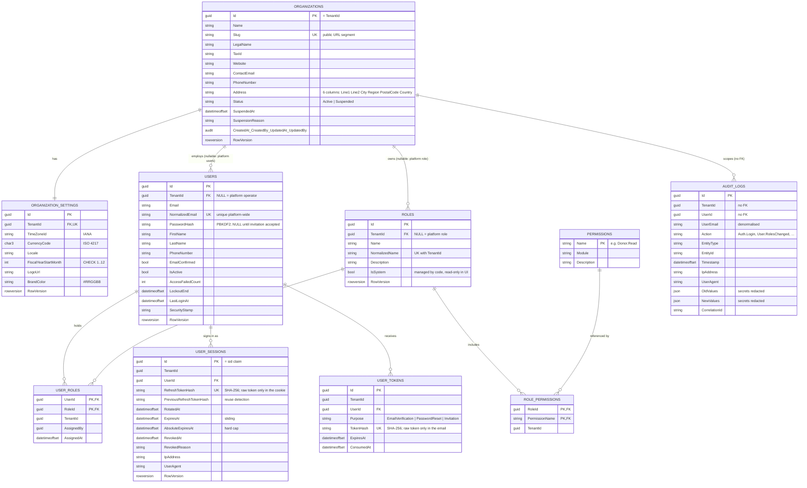

# Database design and ERD

SQL Server, EF Core code-first, **one schema per module**. Conventions applied to every table:

* Primary keys are `uniqueidentifier`, generated by the domain with `Ids.New()`, a time-ordered GUID laid out for
  SQL Server's sort order (avoids clustered-index page splits at 10M+ rows).
* Timestamps are `datetimeoffset` and always UTC; the UI converts to the organization's time zone.
* Money will be `decimal(18,2)` (never floating point); currency is the organization's ISO 4217 code.
* Auditable entities carry `CreatedAt/CreatedBy/UpdatedAt/UpdatedBy` (stamped by the save interceptor, never by callers) and a
  `RowVersion` (`rowversion`) for optimistic concurrency; a stale write returns HTTP 409.
* Every tenant-owned table has `TenantId` with a foreign key to `organizations.Organizations` (`ON DELETE NO ACTION`) and an
  index that leads with it. The `audit.AuditLogs` table deliberately has no FK: the log must outlive and never block anything.
* Enums are stored as readable strings (`Active`, `PasswordReset`), not magic integers.
* Database defaults set by `infra/sqlserver/init.sql`: `READ_COMMITTED_SNAPSHOT ON`, `ALLOW_SNAPSHOT_ISOLATION ON`.

## Implemented (Phase 1)

Supporting tables: `messaging.OutboxMessage / OutboxState / InboxState` (MassTransit transactional outbox and consumer
inbox), `security.DataProtectionKeys` (Data Protection key ring), `hangfire.*` (Hangfire), `dbo.__EFMigrationsHistory`.

### Notable indexes and constraints

| Table | Index / constraint | Why |
| --- | --- | --- |
| `Users` | `UX (NormalizedEmail)` | One identity = one organization; login looks up by email alone |
| `Users` | `IX (TenantId, IsActive)` | Tenant user lists and admin counts |
| `Roles` | `UX (TenantId, NormalizedName)` | Unique per tenant; platform roles share the `NULL` namespace (no filter on the index) |
| `UserSessions` | `UX (RefreshTokenHash)`, filtered `IX (PreviousRefreshTokenHash)` | Token lookup for refresh and reuse detection |
| `UserTokens` | `UX (TokenHash)`, `IX (UserId, Purpose)` | Redeem a link; supersede older ones |
| `AuditLogs` | `IX (TenantId, Timestamp DESC)`, `IX (TenantId, EntityType, EntityId)`, `IX (TenantId, UserId, Timestamp)` | The three ways the log is queried |
| `OrganizationSettings` | `CHECK FiscalYearStartMonth BETWEEN 1 AND 12`, `UX (TenantId)` | 1:1 with Organization |
| `Organizations` | `UX (Slug)`, `IX (Status)` | Public routing and the platform registry |

## Planned model (Phases 2–7)

Sketched here so the foundation's decisions (tenant ownership, schemas, ids) can be checked against where the model is
going. Keys and the important relationships only; columns are designed in each phase.

```mermaid
erDiagram
    ORGANIZATIONS ||--o{ DONORS : owns
    DONORS ||--o{ DONOR_ADDRESSES : has
    DONORS ||--o{ DONOR_CONTACTS : has
    DONORS ||--o{ DONOR_NOTES : has
    DONORS ||--o{ DONOR_INTERACTIONS : has
    DONORS ||--o{ DONOR_TAGS : tagged
    DONORS ||--o{ DONOR_RELATIONSHIPS : "relates to"

    ORGANIZATIONS ||--o{ CAMPAIGNS : runs
    CAMPAIGNS ||--o{ CAMPAIGN_GOALS : sets
    CAMPAIGNS ||--o| CAMPAIGN_PAGES : publishes
    CAMPAIGNS ||--o{ CAMPAIGN_MESSAGES : sends
    CAMPAIGNS ||--o{ CAMPAIGN_METRICS : "daily rollup"

    DONORS ||--o{ DONATIONS : gives
    CAMPAIGNS ||--o{ DONATION_ALLOCATIONS : receives
    DONATIONS ||--o{ DONATION_LINES : "made of"
    DONATIONS ||--o{ DONATION_ALLOCATIONS : "allocated to"
    DONATIONS ||--o{ DONATION_REFUNDS : "refunded by"
    DONATIONS ||--o| DONATION_RECEIPTS : "acknowledged by"
    DONORS ||--o{ RECURRING_DONATIONS : subscribes
    DONATIONS }o--|| PAYMENT_TRANSACTIONS : "settled by"

    ORGANIZATIONS ||--o{ EVENTS : hosts
    EVENTS ||--o{ EVENT_TICKETS : sells
    EVENTS ||--o{ EVENT_REGISTRATIONS : receives
    EVENTS ||--o{ EVENT_TABLES : seats
    EVENT_TABLES ||--o{ EVENT_SEATS : contains
    EVENT_REGISTRATIONS ||--o{ EVENT_CHECKINS : "checked in"
    EVENTS ||--o{ EVENT_SPONSORS : "sponsored by"

    EVENTS ||--o{ AUCTIONS : "may run"
    AUCTIONS ||--o{ AUCTION_ITEMS : lists
    AUCTION_CATEGORIES ||--o{ AUCTION_ITEMS : groups
    AUCTION_ITEMS ||--o{ AUCTION_BIDS : attracts
    AUCTION_ITEMS ||--o| AUCTION_WINNERS : "won by"
    AUCTION_WINNERS ||--o| AUCTION_PAYMENTS : "paid via"

    ORGANIZATIONS ||--o{ SPONSORS : "has"
    SPONSOR_PACKAGES ||--o{ SPONSORS : "level of"
    SPONSOR_PACKAGES ||--o{ SPONSOR_BENEFITS : includes

    ORGANIZATIONS ||--o{ VOLUNTEERS : "has"
    VOLUNTEERS ||--o{ VOLUNTEER_ASSIGNMENTS : works
    VOLUNTEER_SHIFTS ||--o{ VOLUNTEER_ASSIGNMENTS : staffed

    EMAIL_TEMPLATES ||--o{ EMAIL_CAMPAIGNS : "used by"
    EMAIL_CAMPAIGNS ||--o{ EMAIL_RECIPIENTS : "sent to"
    ORGANIZATIONS ||--o{ NOTIFICATIONS : shows

    PAYMENT_PROVIDERS ||--o{ PAYMENT_METHODS : offers
    PAYMENT_PROVIDERS ||--o{ PAYMENT_TRANSACTIONS : processes
    PAYMENT_PROVIDERS ||--o{ PAYMENT_WEBHOOKS : "notifies via"

    REPORT_DEFINITIONS ||--o{ REPORTS : "instantiated as"
    REPORTS ||--o{ REPORT_EXECUTIONS : "run as"
```

Design notes that matter for those phases:

* **Auction bids** carry a `RowVersion` on `AUCTION_ITEMS` (current highest bid, bidder, count); placing a bid is a single
  conditional update inside a transaction, so two simultaneous bidders can never both "win". Covered by a concurrency test in Phase 4.
* **Webhook idempotency** is a unique index on `(ProviderId, ProviderEventId)` in `PAYMENT_WEBHOOKS`; a replay is a no-op.
* **Donations at 10M+ rows** get keyset pagination and covering indexes on `(TenantId, CreatedAt DESC, Id)`; report queries use
  projections and read-committed-snapshot so they never block writers.
* **Donor personal data** stays in the `donors` schema so erasure requests (GDPR) touch one place, with a redaction workflow
  that keeps financial records intact.
