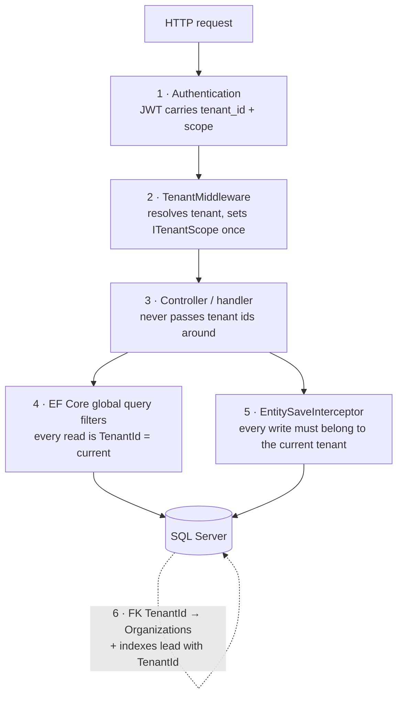

# Multi-tenant architecture

**Every organization is a tenant. One organization must never see, change or infer another's data.** FundFlow uses a
*shared database, shared schema* model: all tenants live in the same tables, distinguished by a `TenantId` column.
That keeps operations simple and cost-effective at 10,000+ organizations; the price is that isolation must be enforced
in software, so it is enforced in **layers**, each of which is tested.

## Concepts

| Term | Meaning |
| --- | --- |
| **Tenant** | An `Organization`. Its `Id` *is* the `TenantId` stamped on every tenant-owned row. |
| **Tenant scope** | The tenant the current unit of work is bound to. Set **once**, then immutable. |
| **Platform scope** | For SUPER_ADMIN operators. Sees the organization registry and platform-level rows (`TenantId IS NULL`), **never** tenant data. |
| **Unscoped** | No scope established (anonymous, background job). Tenant tables return nothing. **Fails closed.** |

## How a request gets its tenant

`ITenantProvider` (pure logic, unit-tested) decides; `TenantMiddleware` applies the decision:

| Caller | Source of tenant | Result |
| --- | --- | --- |
| Authenticated tenant user | `tenant_id` claim in the validated JWT | Tenant scope |
| Authenticated tenant user + URL names the *same* tenant (`/public/organizations/{slug}`) | Claim (slug must match) | Tenant scope |
| Authenticated tenant user + URL names a *different* tenant | — | **403 `tenant_mismatch`** |
| Authenticated but token lacks a tenant claim | — | **403** (never falls back to a URL hint) |
| Platform operator | `scope = platform` claim | Platform scope |
| Anonymous on a public route | `{tenantSlug}` route value → tenant directory (cached) | Tenant scope (read-only public endpoints) |
| Anonymous, no slug (login, register) | — | Unscoped; the handler discovers the tenant from the credential owner (`IgnoreQueryFilters`) and then scopes the unit of work |
| Tenant is suspended | tenant directory (`Status`) | **403 `organization_suspended`** for members; **404** for anonymous visitors |

The JWT is authoritative: a tenant id in a URL or header can never widen access.

## The three enforcement points

### 1 · Reads: global query filters (by convention)

`AppDbContext.ApplyConventions` walks every entity type at model-build time:

| Entity marker | Filter |
| --- | --- |
| `ITenantEntity` (`Guid TenantId`) — donors, donations, … | `e.TenantId == CurrentTenantId` |
| `IOptionalTenantEntity` (`Guid? TenantId`) — users, roles, sessions, audit | `(IsPlatformScope && e.TenantId == null) OR (CurrentTenantId != null && e.TenantId == CurrentTenantId)` |
| `Organization` (the registry) | `IsPlatformScope OR e.Id == CurrentTenantId` |

Because the filters are applied by convention, **a new entity that implements the marker cannot forget its filter**.
`CurrentTenantId`/`IsPlatformScope` are read from the scoped `ITenantContext` per query, so one cached model serves all tenants.

Bypassing a filter requires an explicit, greppable `IgnoreQueryFilters()`. The complete list of legitimate uses today:

* **Authentication discovery** — login, refresh, logout, password reset, email verification, invitation: the tenant is not known
  until the credential or token is looked up; the handler then calls `ITenantScope.UseScopeOf(user.TenantId)`.
* **Global uniqueness checks** — email and slug availability at registration/invite.
* **Tenant directory & access provider** — keyed by ids from validated tokens.
* **Maintenance jobs and the database initializer** — session cleanup, reference-data sync.
* **Platform registry** user counts.

Any new use should be justified in review; `grep -rn IgnoreQueryFilters src/` is the audit list.

### 2 · Writes: `EntitySaveInterceptor`

Defence in depth for the day someone forgets to scope a query. On every `SaveChanges`:

* an `ITenantEntity` **without** a tenant scope, or belonging to a different tenant → `TenantViolationException` (HTTP 403);
* a new `ITenantEntity` with `TenantId == Guid.Empty` is stamped with the scope's tenant;
* inside a tenant scope, an optional-tenant row must carry that tenant (a tenant cannot plant a row in another tenant, or a platform row);
* a tenant scope may only modify **its own** `Organization`;
* `AuditLog` rows cannot be modified or deleted.

### 3 · Scope immutability: `TenantContext`

`ITenantScope.UseTenant` is idempotent for the same tenant and **throws** if asked to switch tenants or to enter platform
scope (and vice versa). A buggy handler cannot hop from one tenant's data to another's mid-request.

## What the platform operator can and cannot do

SUPER_ADMIN has exactly two permissions, `Platform.Manage` and `Audit.Read`:

* list organizations (name, slug, status, **user count**), suspend/reactivate them;
* see platform-level audit events;
* **cannot** list a tenant's users, roles, donors, donations, reports — the filters return nothing and the endpoints are gated by tenant permissions the operator lacks.

Support access to a tenant's data (impersonation with consent, time-boxed, fully audited) is a deliberate future feature, not
a side effect of a permissive filter.

## Other tenant-sensitive design choices

* **Email uniqueness is platform-wide.** One identity belongs to exactly one organization, so login needs only an email
  and cannot reveal which organizations exist. (Multi-organization membership is a future migration; see ADR-0002.)
* **Caches are keyed by tenant-derived ids** (`tenant:id:{guid}`, `access:{userId}`) — never by anything a request can spoof.
* **Slugs** are lower-case, reserved-word-checked, unique, and immutable (shared links keep working).
* **404, not 403, for other tenants' records.** A record that exists in another tenant is indistinguishable from one that does not exist.

## Tests that prove it

`tests/FundFlow.Api.IntegrationTests/TenantIsolationTests.cs` runs against a real SQL Server and checks, among others:

* A's most privileged user cannot fetch, search, list, update, deactivate or re-role B's user, and the error is identical to "not found";
* A cannot read, edit, delete or **assign** B's roles, nor invite a user with B's role id;
* audit logs, organization profile and settings never cross tenants;
* a token for A pointed at B's public URL gets 403;
* platform operators see the registry but no tenant data;
* at the data layer: scoped reads return only that tenant; **no scope returns nothing**; platform scope sees platform rows only;
  writing a row for another tenant, modifying tenant data with no/wrong scope, modifying another tenant's organization,
  and mutating the audit log all throw; a scope cannot be switched.

`FundFlow.Application.Tests/Tenancy/TenantProviderTests.cs` covers the resolution table above without any HTTP.
